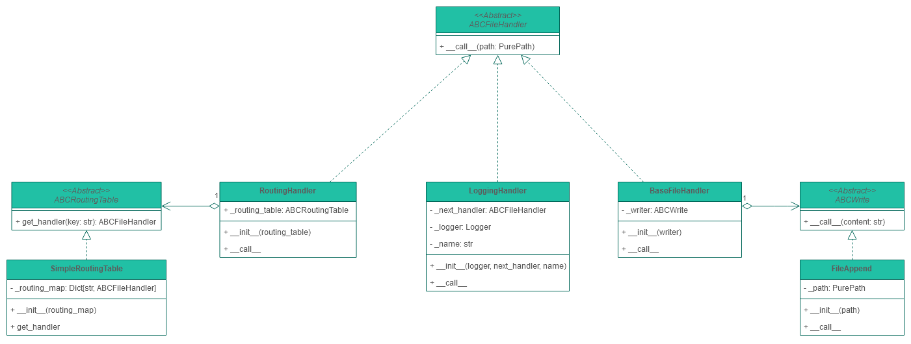

# Initialization
## Clone project
```bash
git clone https://github.com/yari61/otus-patterns-chain-of-responsibility.git
cd otus-patterns-chain-of-responsibility
```

## Virtual environment
It is recommended to create a virtual environment at first (.venv for example)
```bash
python -m venv .venv
```

Then activate it with
- ```source .venv/bin/activate```
on Unix-like systems, or
- ```.venv\Scripts\activate```
if Your system runs Windows

## Installation
To install the package run the next command in your virtual environment
```bash
pip install -e .
```

## Testing
To run tests execute the command listed below
```bash
python -m unittest
```

# Project description
## Goal
The main goal of this program is to load list of files to handle, and use specific handler for each file type.
## Class diagram

## Sequence diagram

# Quick start guide
## Command line interface
```bash
python -m file_parser -i /path/to/input/file -o /path/to/output/file
```
## Input file example
```
#/path/to/input/file

/path/to/file1.txt
/path/to/file2.json
/path/to/file3.csv
/path/to/file4.xml
```